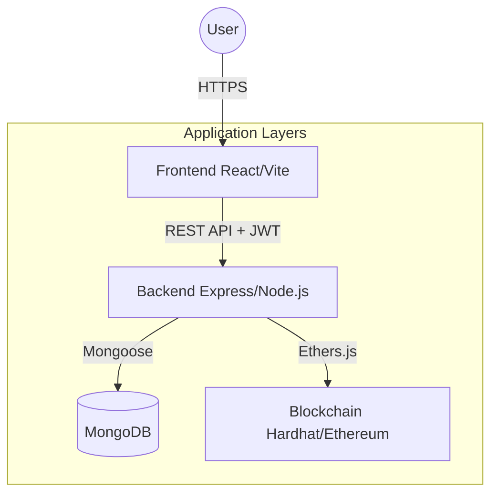

# System Architecture: Blockchain-Based Document Integrity Verification System (BBDIVS)

This document provides a technical overview of the system's architecture, core modules, and the flow of data across the platform.

---

## 🏗️ High-Level Architecture

The BBDIVS is built on a **Layered Architecture** that separates the user interface, business logic, and immutable data storage. This ensures scalability, security, and ease of maintenance.

---

## 📦 Core Modules

### 1. Frontend Module (`frontend/`)
The Frontend is a modern Single Page Application (SPA) built with **React** and **Vite**.

- **Responsibility**: User interaction, data visualization, and client-side validation.
- **Key Features**:
  - **Security**: JWT-based authentication with role-based access control (Admin/Staff/User).
  - **Dynamic Dashboard**: Real-time stats and audit trail browsing.
  - **Hashing**: Performs client-side file integrity checks before upload.
- **Technology Stack**: React 19, Vite, Tailwind CSS, Axios, Lucide Icons.

### 2. Backend Module (`backend/`)
The Backend is the central "brain" of the system, coordinating all interactions between the UI, database, and blockchain.

- **Responsibility**: API management, authentication logic, file processing, and blockchain anchoring.
- **Sub-components**:
  - **Controllers**: Handle HTTP requests and responses.
  - **Services**: Enclose specialized logic for QR code generation, file storage, and blockchain communication.
  - **Middleware**: Manages security headers (Helmet), logging (Morgan), and file uploads (Multer).
- **Technology Stack**: Node.js, Express 5, Mongoose, JWT, Ethers.js.

### 3. Blockchain Module (`hardhat-example/`)
The Blockchain layer provides the "Anchor of Truth" for document verification.

- **Responsibility**: Immutable storage of document hashes and timestamps.
- **Smart Contract (`DocumentIntegrity.sol`)**:
  - Stores a mapping of `documentUID` to its cryptographic hash.
  - Provides public functions for verification that anyone can use to cross-refeence a file.
- **Technology Stack**: Solidity, Hardhat, OpenZeppelin.

---

## 🔄 Data Flows & Connections

### 1. Document Registration (Anchoring)
1. **Frontend**: User selects a file. The frontend generates a SHA-256 hash.
2. **Backend**: Receives the file and metadata. Stores the file in local storage and metadata in **MongoDB**.
3. **Blockchain**: The backend calls the `storeDocumentHash` function in the smart contract to permanently anchor the hash.
4. **Audit**: An "Anchored" event is logged in the `AuditLog` collection.

### 2. Verification Flow (Tamper Detection)
1. **Input**: User uploads a file or scans a QR code for verification.
2. **Comparison**:
   - **Local Check**: Backend compares the uploaded file's hash against the hash in **MongoDB**.
   - **Blockchain Check**: Backend queries the **Smart Contract** for the anchored hash.
3. **Verdict**: If all hashes match, the document is marked as **Authentic**. If there is any discrepancy, the system reports **Tampered**.

### 3. Connection Summary
- **Frontend ↔ Backend**: REST API on Port 5000 via Axios.
- **Backend ↔ Database**: Mongoose connection to MongoDB (`mongodb://localhost:27017`).
- **Backend ↔ Blockchain**: Ethers.js provider connecting to Hardhat on Port 8545.

---

## 🔒 Security Measures
- **Data Immuntability**: Once a hash is on the blockchain, it cannot be changed or deleted.
- **Cryptographic Integrity**: SHA-256 ensures even a single bit change in a document is detectable.
- **Authentication**: Stateless JWT authentication with secured expiration.
- **CORS & Helmet**: Protects against common web vulnerabilities like XSS and Clickjacking.
